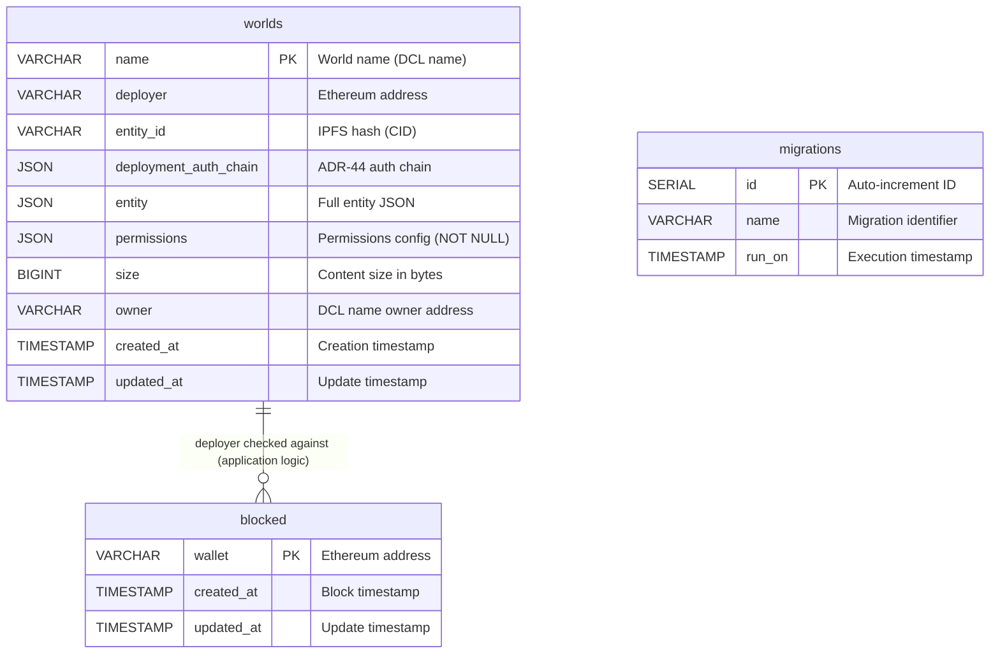

# Database Schema Documentation

This document describes the database schema for the Worlds Content Server. The schema uses PostgreSQL and is managed through migrations located in `src/migrations/`.

## Tables Overview

The database contains two main tables:
1. **`worlds`** - Stores world/scene deployment information
2. **`blocked`** - Stores blocked wallet addresses
3. **`migrations`** - Tracks executed database migrations (internal, managed automatically)

---

## Database Schema Diagram



**Relationship Notes:**
- `worlds.deployer` and `worlds.owner` store Ethereum addresses (no foreign keys, validated via blockchain in application layer)
- `blocked.wallet` can be checked against `worlds.deployer` for access control (application-level validation)
- The `migrations` table is managed automatically by the migration system
- **No foreign key constraints exist** - relationships are enforced at the application level

---

## Table: `worlds`

Stores all deployed worlds (scenes identified by DCL names) and their associated metadata, permissions, and entity data.

### Columns

| Column | Type | Nullable | Description |
|--------|------|----------|-------------|
| `name` | VARCHAR | NOT NULL | **Primary Key**. World name (DCL name, e.g., `"myworld.dcl.eth"`). Stored in lowercase. |
| `deployer` | VARCHAR | NULL | Ethereum address of the wallet that deployed the world. Used for indexing. |
| `entity_id` | VARCHAR | NULL | IPFS hash (CID) of the deployed entity. Null if world exists but has no deployment. |
| `deployment_auth_chain` | JSON | NULL | Authentication chain used for deployment. Array of `AuthLink` objects following ADR-44. |
| `entity` | JSON | NULL | Full entity JSON object containing scene metadata, content mappings, and all entity data. |
| `permissions` | JSON | **NOT NULL** | Permissions configuration object. See [Permissions Structure](#permissions-structure) below. |
| `size` | BIGINT | NULL | Total size of all world content files in bytes. Calculated from entity content hashes. |
| `owner` | VARCHAR | NULL | Ethereum address of the DCL name owner (verified via blockchain). |
| `created_at` | TIMESTAMP | NOT NULL | Timestamp when the world record was first created. |
| `updated_at` | TIMESTAMP | NOT NULL | Timestamp when the world record was last updated. |

### Indexes

- **Primary Key**: `name`
- **Index**: `worlds_deployer_index` on `deployer` column

### Permissions Structure

The `permissions` column stores a JSON object with the following structure:

```typescript
type Permissions = {
  deployment: AllowListPermissionSetting  // Who can deploy/update the world
  access: AccessPermissionSetting         // Who can access/visit the world
  streaming: UnrestrictedPermissionSetting | AllowListPermissionSetting  // Who can stream to the world
}
```

#### Permission Types

1. **`deployment`** (Always AllowList)
   ```json
   {
     "type": "allow-list",
     "wallets": ["0x...", "0x..."]  // Array of lowercase Ethereum addresses
   }
   ```

2. **`access`** (One of: Unrestricted, AllowList, SharedSecret, NFTOwnership)
   ```json
   // Unrestricted
   {
     "type": "unrestricted"
   }
   
   // AllowList
   {
     "type": "allow-list",
     "wallets": ["0x...", "0x..."]
   }
   
   // SharedSecret
   {
     "type": "shared-secret",
     "secret": "bcrypt-hashed-secret"
   }
   
   // NFTOwnership
   {
     "type": "nft-ownership",
     "nft": "urn:decentraland:matic:collections-v2:0x...:1"
   }
   ```

3. **`streaming`** (Unrestricted or AllowList only)
   ```json
   // Unrestricted
   {
     "type": "unrestricted"
   }
   
   // AllowList
   {
     "type": "allow-list",
     "wallets": ["0x...", "0x..."]
   }
   ```

#### Default Permissions

```json
{
  "deployment": {
    "type": "allow-list",
    "wallets": []
  },
  "access": {
    "type": "unrestricted"
  },
  "streaming": {
    "type": "allow-list",
    "wallets": []
  }
}
```

### Entity Structure

The `entity` column stores the full Decentraland entity JSON. Key fields include:

```json
{
  "id": "bafkreihpipyhrt75xyquwrynrtjadwb373xfosy7a5rhlh5vogjajye3im",
  "type": "scene",
  "timestamp": 1699123456789,
  "pointers": ["myworld.dcl.eth"],
  "content": [
    {
      "file": "scene.json",
      "hash": "QmHash..."
    },
    {
      "file": "models/scene.glb",
      "hash": "QmHash..."
    }
  ],
  "metadata": {
    "worldConfiguration": {
      "minimap": { ... },
      "skybox": { ... }
    },
    "owner": "0x..."
  }
}
```

### Deployment Auth Chain Structure

The `deployment_auth_chain` column stores an array of authentication links:

```json
[
  {
    "type": "SIGNER",
    "payload": "0xd9b96b5dc720fc52bede1ec3b40a930e15f70ddd",
    "signature": ""
  },
  {
    "type": "ECDSA_PERSONAL_EPHEMERAL",
    "payload": "Decentraland Login\nEphemeral address: 0x...\nExpiration: ...",
    "signature": "0x..."
  }
]
```

### Constraints and Business Rules

1. **Name Uniqueness**: Each world name must be unique (enforced by primary key)
2. **Name Format**: World names should be lowercase (handled by application layer)
3. **Permissions**: Must never be NULL (enforced by NOT NULL constraint)
4. **Owner Validation**: The `owner` field is validated against blockchain DCL name ownership
5. **Size Calculation**: The `size` field is calculated from entity content file sizes stored in S3/disk
6. **Address Normalization**: All Ethereum addresses in permissions are stored in lowercase

---

## Table: `blocked`

Stores wallet addresses that have been blocked from deploying or accessing worlds.

### Columns

| Column | Type | Nullable | Description |
|--------|------|----------|-------------|
| `wallet` | VARCHAR | NOT NULL | **Primary Key**. Ethereum address of the blocked wallet (lowercase). |
| `created_at` | TIMESTAMP | NOT NULL | Timestamp when the wallet was first blocked. |
| `updated_at` | TIMESTAMP | NOT NULL | Timestamp when the block record was last updated. |

### Indexes

- **Primary Key**: `wallet`
- **Index**: `blocked_wallet_index` on `wallet` column

### Business Rules

1. Wallet addresses are stored in lowercase
2. Blocked wallets are checked before allowing deployments and access

---

## Table: `migrations` (Internal)

Tracks which database migrations have been executed. This table is managed automatically by the migration system and should not be modified manually.

---

## Related Code

- **Migrations**: `src/migrations/`
- **World Manager**: `src/adapters/worlds-manager.ts`
- **Permissions Checker**: `src/logic/permissions-checker.ts`
- **Types**: `src/types.ts` (see `WorldRecord`, `Permissions`, `BlockedRecord`)
