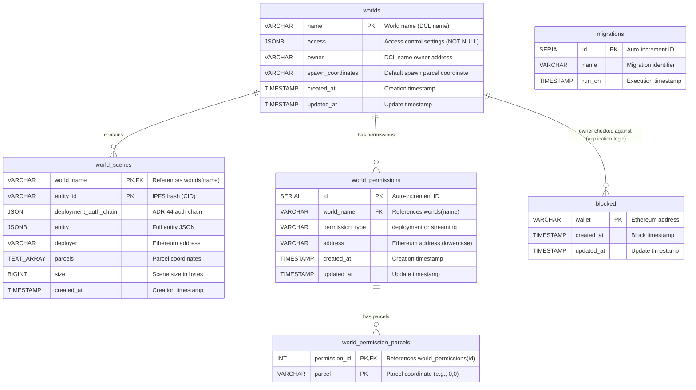

# Database Schema Documentation

This document describes the database schema for the Worlds Content Server. The schema uses PostgreSQL and is managed through migrations located in `src/migrations/`.

## Tables Overview

The database contains the following main tables:

1. **`worlds`** - Stores world metadata and access settings
2. **`world_scenes`** - Stores individual scene deployments within worlds (multi-scene support)
3. **`world_permissions`** - Stores deployment and streaming permission grants
4. **`world_permission_parcels`** - Stores parcel-level permission restrictions (normalized)
5. **`blocked`** - Stores blocked wallet addresses
6. **`migrations`** - Tracks executed database migrations (internal, managed automatically)

---

## Database Schema Diagram



**Relationship Notes:**

- `worlds` → `world_scenes`: One-to-many relationship (one world contains multiple scenes)
- `worlds` → `world_permissions`: One-to-many relationship (one world has multiple permission grants)
- `world_permissions` → `world_permission_parcels`: One-to-many relationship (one permission can have multiple parcels)
- `world_scenes.world_name` references `worlds.name` with CASCADE delete
- `world_permissions.world_name` references `worlds.name` with CASCADE delete
- `world_permission_parcels.permission_id` references `world_permissions.id` with CASCADE delete
- `worlds.owner` and `world_scenes.deployer` store Ethereum addresses (validated via blockchain)
- `blocked.wallet` can be checked against `worlds.owner` for access control (application-level validation)
- The `migrations` table is managed automatically by the migration system

---

## Table: `worlds`

Stores world metadata and access settings. With multi-scene support, this table contains world-level configuration while individual scenes are stored in `world_scenes`.

### Columns

| Column              | Type      | Nullable     | Description                                                                              |
| ------------------- | --------- | ------------ | ---------------------------------------------------------------------------------------- |
| `name`              | VARCHAR   | NOT NULL     | **Primary Key**. World name (DCL name, e.g., `"myworld.dcl.eth"`). Stored in lowercase.  |
| `access`            | JSONB     | **NOT NULL** | Access control settings. See [Access Settings](#access-settings) below.                  |
| `owner`             | VARCHAR   | NULL         | Ethereum address of the DCL name owner (verified via blockchain).                        |
| `spawn_coordinates` | VARCHAR   | NULL         | World spawn parcel coordinate (e.g., `"0,0"`). Must belong be a coordinate inside of the world's shape. |
| `created_at`        | TIMESTAMP | NOT NULL     | Timestamp when the world record was first created.                                       |
| `updated_at`        | TIMESTAMP | NOT NULL     | Timestamp when the world record was last updated.                                        |

### Indexes

- **Primary Key**: `name`

### Access Settings

The `access` column stores a JSON object controlling who can visit/access the world:

```typescript
type AccessSetting =
  | UnrestrictedAccessSetting
  | SharedSecretAccessSetting
  | NftOwnershipAccessSetting
  | AllowListAccessSetting
```

#### Access Types

1. **Unrestricted** - Anyone can access

   ```json
   {
     "type": "unrestricted"
   }
   ```

2. **AllowList** - Only specified wallets can access

   ```json
   {
     "type": "allow-list",
     "wallets": ["0x...", "0x..."]
   }
   ```

3. **SharedSecret** - Access requires a secret password

   ```json
   {
     "type": "shared-secret",
     "secret": "bcrypt-hashed-secret"
   }
   ```

4. **NFTOwnership** - Access requires ownership of a specific NFT

   ```json
   {
     "type": "nft-ownership",
     "nft": "urn:decentraland:matic:collections-v2:0x...:1"
   }
   ```

#### Default Access

```json
{
  "type": "unrestricted"
}
```

---

## Table: `world_scenes`

Stores individual scene deployments within worlds. Each world can have multiple scenes deployed to different parcels.

### Columns

| Column                  | Type      | Nullable | Description                                                                                  |
| ----------------------- | --------- | -------- | -------------------------------------------------------------------------------------------- |
| `world_name`            | VARCHAR   | NOT NULL | **Primary Key (part 1)**, **Foreign Key** → `worlds(name)`. The world this scene belongs to. |
| `entity_id`             | VARCHAR   | NOT NULL | **Primary Key (part 2)**. IPFS hash (CID) of the deployed scene entity.                      |
| `deployment_auth_chain` | JSON      | NOT NULL | Authentication chain used for deployment. Array of `AuthLink` objects following ADR-44.      |
| `entity`                | JSONB     | NOT NULL | Full entity JSON object containing scene metadata, content mappings, and all entity data.    |
| `deployer`              | VARCHAR   | NOT NULL | Ethereum address of the wallet that deployed this scene.                                     |
| `parcels`               | TEXT[]    | NOT NULL | Array of parcel coordinates this scene occupies (e.g., `['0,0', '0,1', '1,0']`).             |
| `size`                  | BIGINT    | NOT NULL | Total size of this scene's content files in bytes.                                           |
| `created_at`            | TIMESTAMP | NOT NULL | Timestamp when the scene was first deployed.                                                 |

### Indexes

- **Primary Key**: `(world_name, entity_id)` (composite primary key)
- **Index**: `world_scenes_world_name_idx` on `world_name` column
- **GIN Index**: `world_scenes_parcels_idx` on `parcels` column (for array operations)
- **Index**: `world_scenes_deployer_idx` on `deployer` column

### Constraints

- **Foreign Key**: `world_name` REFERENCES `worlds(name)` ON DELETE CASCADE
  - When a world is deleted, all its scenes are automatically deleted

### Entity Structure

The `entity` column stores the full Decentraland entity JSON. Key fields include:

```json
{
  "id": "bafkreihpipyhrt75xyquwrynrtjadwb373xfosy7a5rhlh5vogjajye3im",
  "type": "scene",
  "timestamp": 1699123456789,
  "pointers": ["myworld.dcl.eth"],
  "content": [
    {
      "file": "scene.json",
      "hash": "QmHash..."
    },
    {
      "file": "models/scene.glb",
      "hash": "QmHash..."
    }
  ],
  "metadata": {
    "worldConfiguration": {
      "minimap": { ... },
      "skybox": { ... }
    },
    "owner": "0x..."
  }
}
```

### Deployment Auth Chain Structure

The `deployment_auth_chain` column stores an array of authentication links:

```json
[
  {
    "type": "SIGNER",
    "payload": "0xd9b96b5dc720fc52bede1ec3b40a930e15f70ddd",
    "signature": ""
  },
  {
    "type": "ECDSA_PERSONAL_EPHEMERAL",
    "payload": "Decentraland Login\nEphemeral address: 0x...\nExpiration: ...",
    "signature": "0x..."
  }
]
```

---

## Table: `world_permissions`

Stores deployment and streaming permission grants for worlds. Each record represents a single wallet's permission to deploy or stream to a world.

### Columns

| Column            | Type      | Nullable | Description                                                               |
| ----------------- | --------- | -------- | ------------------------------------------------------------------------- |
| `id`              | SERIAL    | NOT NULL | **Primary Key**. Auto-incrementing unique identifier.                     |
| `world_name`      | VARCHAR   | NOT NULL | **Foreign Key** → `worlds(name)`. The world this permission belongs to.   |
| `permission_type` | VARCHAR   | NOT NULL | Type of permission: `'deployment'` or `'streaming'`.                      |
| `address`         | VARCHAR   | NOT NULL | Ethereum address of the wallet being granted permission (lowercase).      |
| `created_at`      | TIMESTAMP | NOT NULL | Timestamp when the permission was granted.                                |
| `updated_at`      | TIMESTAMP | NOT NULL | Timestamp when the permission was last updated.                           |

### Indexes

- **Primary Key**: `id`
- **Unique Constraint**: `(world_name, permission_type, address)` - Each wallet can only have one permission record per type per world
- **Index**: `world_permissions_address_idx` on `address` column (for fast wallet lookups)
- **Index**: `world_permissions_world_permission_idx` on `(world_name, permission_type)` (for listing permissions)

### Constraints

- **Foreign Key**: `world_name` REFERENCES `worlds(name)` ON DELETE CASCADE
  - When a world is deleted, all its permissions are automatically deleted

---

## Table: `world_permission_parcels`

Stores parcel-level restrictions for permissions. When a permission has entries in this table, the wallet can only deploy/stream to those specific parcels. When no entries exist, the permission is "world-wide" (can access all parcels).

### Columns

| Column          | Type    | Nullable | Description                                                                     |
| --------------- | ------- | -------- | ------------------------------------------------------------------------------- |
| `permission_id` | INT     | NOT NULL | **Primary Key (part 1)**, **Foreign Key** → `world_permissions(id)`.            |
| `parcel`        | VARCHAR | NOT NULL | **Primary Key (part 2)**. Parcel coordinate (e.g., `"0,0"`, `"-5,10"`).         |

### Indexes

- **Primary Key**: `(permission_id, parcel)` (composite primary key)
- **Index**: `world_permission_parcels_parcel_idx` on `parcel` column (for parcel lookups)

### Constraints

- **Foreign Key**: `permission_id` REFERENCES `world_permissions(id)` ON DELETE CASCADE
  - When a permission is deleted, all its parcel entries are automatically deleted

### Permission Checking Logic

When checking if a wallet can deploy/stream to parcels `["0,0", "1,0"]`:

1. **World-wide permission**: If no entries exist in `world_permission_parcels` for this permission → ✅ Allowed for all parcels
2. **Parcel-specific permission**: If entries exist in `world_permission_parcels`:
   - Check if all target parcels are in the table for this permission
   - If yes → ✅ Allowed
   - If any parcel is missing → ❌ Denied

### Example Data

**world_permissions table:**

| id  | world_name      | permission_type | address        |
| --- | --------------- | --------------- | -------------- |
| 1   | myworld.dcl.eth | deployment      | 0xadmin1...    |
| 2   | myworld.dcl.eth | deployment      | 0xbuilder1...  |
| 3   | myworld.dcl.eth | streaming       | 0xstreamer1... |
| 4   | myworld.dcl.eth | streaming       | 0xstreamer2... |

**world_permission_parcels table:**

| permission_id | parcel |
| ------------- | ------ |
| 2             | 0,0    |
| 2             | 1,0    |
| 2             | 0,1    |
| 4             | 0,0    |

In this example:
- `0xadmin1...` has world-wide deployment permission (no parcels in `world_permission_parcels` for id=1)
- `0xbuilder1...` can only deploy to parcels `0,0`, `1,0`, and `0,1`
- `0xstreamer1...` has world-wide streaming permission (no parcels for id=3)
- `0xstreamer2...` can only stream to parcel `0,0`

### Business Rules

1. **Address Normalization**: All addresses are stored in lowercase
2. **World-wide vs Parcel-specific**:
   - No rows in `world_permission_parcels` = world-wide permission (can access any parcel)
   - Rows exist = parcel-specific permission (can only access those parcels)
3. **Unique Permission**: A wallet can only have one deployment and one streaming permission per world

---

## Table: `blocked`

Stores wallet addresses that have been blocked from deploying or accessing worlds.

### Columns

| Column       | Type      | Nullable | Description                                                          |
| ------------ | --------- | -------- | -------------------------------------------------------------------- |
| `wallet`     | VARCHAR   | NOT NULL | **Primary Key**. Ethereum address of the blocked wallet (lowercase). |
| `created_at` | TIMESTAMP | NOT NULL | Timestamp when the wallet was first blocked.                         |
| `updated_at` | TIMESTAMP | NOT NULL | Timestamp when the block record was last updated.                    |

### Indexes

- **Primary Key**: `wallet`
- **Index**: `blocked_wallet_index` on `wallet` column

### Business Rules

1. Wallet addresses are stored in lowercase
2. Blocked wallets are checked before allowing deployments and access

---

## Table: `migrations` (Internal)

Tracks which database migrations have been executed. This table is managed automatically by the migration system and should not be modified manually.

---

## Constraints and Business Rules

1. **Name Uniqueness**: Each world name must be unique (enforced by primary key)
2. **Name Format**: World names should be lowercase (handled by application layer)
3. **Access Settings**: Must never be NULL (enforced by NOT NULL constraint)
4. **Owner Validation**: The `owner` field is validated against blockchain DCL name ownership
5. **Size Calculation**: Total world size = sum of all `world_scenes.size` for the world
6. **Address Normalization**: All Ethereum addresses in permissions are stored in lowercase
7. **Parcel Conflicts**: When deploying a scene, any existing scenes on the same parcels are deleted
8. **Multi-Scene Support**: Multiple scenes can exist per world, each occupying different parcels
9. **Spawn Coordinates**: Must reference a parcel that belongs to a deployed scene in the world

---

## Related Code

- **Migrations**: `src/migrations/`
- **World Manager**: `src/adapters/worlds-manager.ts`
- **Permissions Manager**: `src/adapters/permissions-manager.ts`
- **Permissions Component**: `src/logic/permissions/component.ts`
- **Access Component**: `src/logic/access/component.ts`
- **Types**: `src/types.ts` (see `WorldRecord`, `WorldScene`, `BlockedRecord`)
- **Permission Types**: `src/logic/permissions/types.ts` (see `WorldPermissionRecord`, `AllowListPermission`)
- **Access Types**: `src/logic/access/types.ts` (see `AccessSetting`, `AccessType`)
