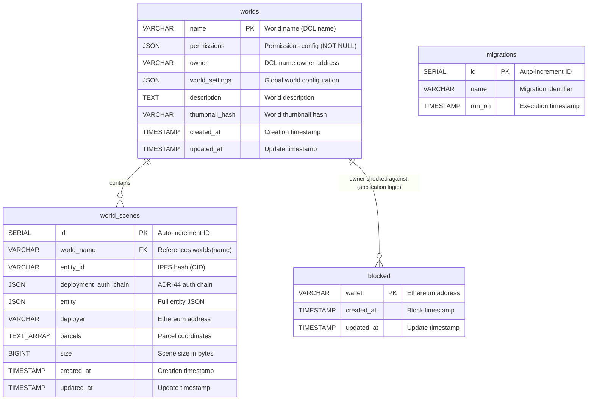

# Database Schema Documentation

This document describes the database schema for the Worlds Content Server. The schema uses PostgreSQL and is managed through migrations located in `src/migrations/`.

## Tables Overview

The database contains the following main tables:

1. **`worlds`** - Stores world metadata, permissions, and global settings
2. **`world_scenes`** - Stores individual scene deployments within worlds (multi-scene support)
3. **`blocked`** - Stores blocked wallet addresses
4. **`migrations`** - Tracks executed database migrations (internal, managed automatically)

---

## Database Schema Diagram



**Relationship Notes:**

- `worlds` → `world_scenes`: One-to-many relationship (one world contains multiple scenes)
- `world_scenes.world_name` references `worlds.name` with CASCADE delete
- `worlds.owner` and `world_scenes.deployer` store Ethereum addresses (validated via blockchain)
- `blocked.wallet` can be checked against `worlds.owner` for access control (application-level validation)
- The `migrations` table is managed automatically by the migration system

---

## Table: `worlds`

Stores world metadata, global settings, and permissions. With multi-scene support, this table contains world-level configuration while individual scenes are stored in `world_scenes`.

### Columns

| Column           | Type      | Nullable     | Description                                                                                                    |
| ---------------- | --------- | ------------ | -------------------------------------------------------------------------------------------------------------- |
| `name`           | VARCHAR   | NOT NULL     | **Primary Key**. World name (DCL name, e.g., `"myworld.dcl.eth"`). Stored in lowercase.                        |
| `permissions`    | JSON      | **NOT NULL** | Permissions configuration object. See [Permissions Structure](#permissions-structure) below.                   |
| `owner`          | VARCHAR   | NULL         | Ethereum address of the DCL name owner (verified via blockchain).                                              |
| `world_settings` | JSON      | NULL         | Global world configuration (minimap, skybox, etc.). See [World Settings Structure](#world-settings-structure). |
| `description`    | TEXT      | NULL         | World description text.                                                                                        |
| `thumbnail_hash` | VARCHAR   | NULL         | Content hash of the world thumbnail image.                                                                     |
| `created_at`     | TIMESTAMP | NOT NULL     | Timestamp when the world record was first created.                                                             |
| `updated_at`     | TIMESTAMP | NOT NULL     | Timestamp when the world record was last updated.                                                              |

### Indexes

- **Primary Key**: `name`

---

## Table: `world_scenes`

Stores individual scene deployments within worlds. Each world can have multiple scenes deployed to different parcels.

### Columns

| Column                  | Type      | Nullable | Description                                                                               |
| ----------------------- | --------- | -------- | ----------------------------------------------------------------------------------------- |
| `id`                    | SERIAL    | NOT NULL | **Primary Key**. Auto-incrementing unique identifier for the scene deployment.            |
| `world_name`            | VARCHAR   | NOT NULL | **Foreign Key** → `worlds(name)`. The world this scene belongs to.                        |
| `entity_id`             | VARCHAR   | NOT NULL | IPFS hash (CID) of the deployed scene entity.                                             |
| `deployment_auth_chain` | JSON      | NOT NULL | Authentication chain used for deployment. Array of `AuthLink` objects following ADR-44.   |
| `entity`                | JSON      | NOT NULL | Full entity JSON object containing scene metadata, content mappings, and all entity data. |
| `deployer`              | VARCHAR   | NOT NULL | Ethereum address of the wallet that deployed this scene.                                  |
| `parcels`               | TEXT[]    | NOT NULL | Array of parcel coordinates this scene occupies (e.g., `['0,0', '0,1', '1,0']`).          |
| `size`                  | BIGINT    | NOT NULL | Total size of this scene's content files in bytes.                                        |
| `created_at`            | TIMESTAMP | NOT NULL | Timestamp when the scene was first deployed.                                              |
| `updated_at`            | TIMESTAMP | NOT NULL | Timestamp when the scene was last updated.                                                |

### Indexes

- **Primary Key**: `id`
- **Unique Constraint**: `(world_name, entity_id)`
- **Index**: `world_scenes_world_name_idx` on `world_name` column
- **GIN Index**: `world_scenes_parcels_idx` on `parcels` column (for array operations)
- **Index**: `world_scenes_deployer_idx` on `deployer` column

### Constraints

- **Foreign Key**: `world_name` REFERENCES `worlds(name)` ON DELETE CASCADE
  - When a world is deleted, all its scenes are automatically deleted

### Permissions Structure

The `permissions` column stores a JSON object with the following structure:

```typescript
type Permissions = {
  deployment: AllowListPermissionSetting // Who can deploy/update the world
  access: AccessPermissionSetting // Who can access/visit the world
  streaming: UnrestrictedPermissionSetting | AllowListPermissionSetting // Who can stream to the world
}
```

#### Permission Types

1. **`deployment`** (Always AllowList)

   ```json
   {
     "type": "allow-list",
     "wallets": ["0x...", "0x..."] // Array of lowercase Ethereum addresses
   }
   ```

2. **`access`** (One of: Unrestricted, AllowList, SharedSecret, NFTOwnership)

   ```json
   // Unrestricted
   {
     "type": "unrestricted"
   }

   // AllowList
   {
     "type": "allow-list",
     "wallets": ["0x...", "0x..."]
   }

   // SharedSecret
   {
     "type": "shared-secret",
     "secret": "bcrypt-hashed-secret"
   }

   // NFTOwnership
   {
     "type": "nft-ownership",
     "nft": "urn:decentraland:matic:collections-v2:0x...:1"
   }
   ```

3. **`streaming`** (Unrestricted or AllowList only)

   ```json
   // Unrestricted
   {
     "type": "unrestricted"
   }

   // AllowList
   {
     "type": "allow-list",
     "wallets": ["0x...", "0x..."]
   }
   ```

#### Default Permissions

```json
{
  "deployment": {
    "type": "allow-list",
    "wallets": []
  },
  "access": {
    "type": "unrestricted"
  },
  "streaming": {
    "type": "allow-list",
    "wallets": []
  }
}
```

### Entity Structure

The `entity` column stores the full Decentraland entity JSON. Key fields include:

```json
{
  "id": "bafkreihpipyhrt75xyquwrynrtjadwb373xfosy7a5rhlh5vogjajye3im",
  "type": "scene",
  "timestamp": 1699123456789,
  "pointers": ["myworld.dcl.eth"],
  "content": [
    {
      "file": "scene.json",
      "hash": "QmHash..."
    },
    {
      "file": "models/scene.glb",
      "hash": "QmHash..."
    }
  ],
  "metadata": {
    "worldConfiguration": {
      "minimap": { ... },
      "skybox": { ... }
    },
    "owner": "0x..."
  }
}
```

### Deployment Auth Chain Structure

The `deployment_auth_chain` column stores an array of authentication links:

```json
[
  {
    "type": "SIGNER",
    "payload": "0xd9b96b5dc720fc52bede1ec3b40a930e15f70ddd",
    "signature": ""
  },
  {
    "type": "ECDSA_PERSONAL_EPHEMERAL",
    "payload": "Decentraland Login\nEphemeral address: 0x...\nExpiration: ...",
    "signature": "0x..."
  }
]
```

### World Settings Structure

The `world_settings` column stores a JSON object with global world configuration:

```json
{
  "name": "Foundation HQ",
  "description": "Decentraland Foundation Headquarters",
  "miniMapConfig": {
    "visible": true,
    "dataImage": "minimap.png",
    "estateImage": "estate.png"
  },
  "skyboxConfig": {
    "fixedTime": 36000,
    "textures": ["sky_top.png", "sky_bottom.png", ...]
  },
  "fixedAdapter": "offline:offline",
  "thumbnailFile": "thumbnail.png"
}
```

### Constraints and Business Rules

1. **Name Uniqueness**: Each world name must be unique (enforced by primary key)
2. **Name Format**: World names should be lowercase (handled by application layer)
3. **Permissions**: Must never be NULL (enforced by NOT NULL constraint)
4. **Owner Validation**: The `owner` field is validated against blockchain DCL name ownership
5. **Size Calculation**: Total world size = sum of all `world_scenes.size` for the world
6. **Address Normalization**: All Ethereum addresses in permissions are stored in lowercase
7. **Parcel Conflicts**: When deploying a scene, any existing scenes on the same parcels are deleted
8. **Multi-Scene Support**: Multiple scenes can exist per world, each occupying different parcels

---

## Table: `blocked`

Stores wallet addresses that have been blocked from deploying or accessing worlds.

### Columns

| Column       | Type      | Nullable | Description                                                          |
| ------------ | --------- | -------- | -------------------------------------------------------------------- |
| `wallet`     | VARCHAR   | NOT NULL | **Primary Key**. Ethereum address of the blocked wallet (lowercase). |
| `created_at` | TIMESTAMP | NOT NULL | Timestamp when the wallet was first blocked.                         |
| `updated_at` | TIMESTAMP | NOT NULL | Timestamp when the block record was last updated.                    |

### Indexes

- **Primary Key**: `wallet`
- **Index**: `blocked_wallet_index` on `wallet` column

### Business Rules

1. Wallet addresses are stored in lowercase
2. Blocked wallets are checked before allowing deployments and access

---

## Table: `migrations` (Internal)

Tracks which database migrations have been executed. This table is managed automatically by the migration system and should not be modified manually.

---

## Related Code

- **Migrations**: `src/migrations/`
- **World Manager**: `src/adapters/worlds-manager.ts`
- **Permissions Checker**: `src/logic/permissions-checker.ts`
- **Types**: `src/types.ts` (see `WorldRecord`, `Permissions`, `BlockedRecord`)
